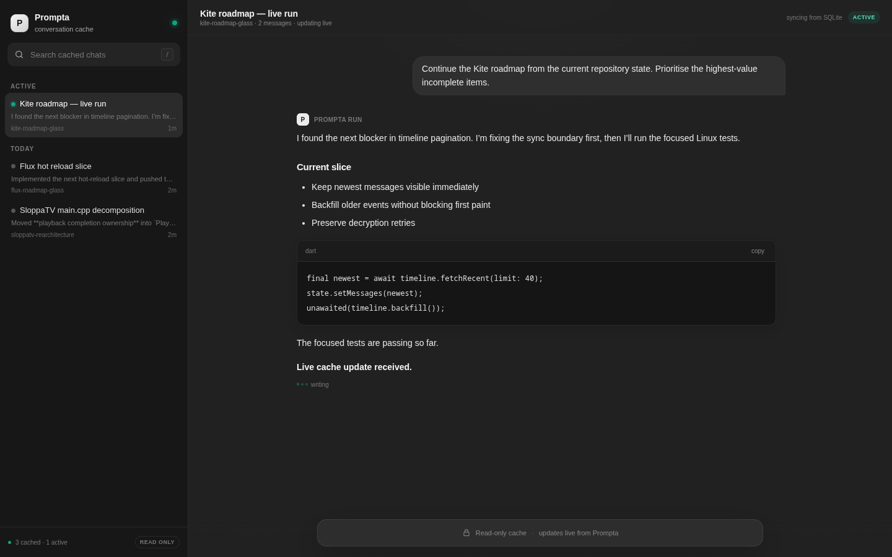

# Prompta

Send ChatGPT prompts once or on a schedule.

## Setup

```bash
uv sync --locked
```

The Firefox profile used by the service lives at 
`~/.local/state/prompta/firefox-profile` and must be logged in to ChatGPT.

## One-shot tasks

Run a prompt immediately without saving it or scheduling another run:

```bash
uv run prompta once "Review the latest build and report any regressions."
```

Each one-shot starts a fresh ChatGPT chat, sends exactly once, passively caches the response to completion, then exits.

## Manage jobs

Repeating jobs default to every 30 minutes:

`list` (`ls`) and `show` display each prompt's status and next due time with a
compact, colour-aware terminal UI. Status icons are `●` healthy, `✗` failing,
`○` pending, `Ⅱ` paused, and `⏳` rate-limited.


The screenshot is generated from the real `prompta ls` formatter with isolated,
deterministic sample jobs:

```bash
uv run python scripts/generate_readme_screenshot.py
```

```bash
# List jobs
uv run prompta ls

# Show one prompt
uv run prompta show flux-roadmap

# Add or replace a 30-minute job
uv run prompta add my-job "Do the maximum amount of work possible."

# Add or replace a job with another cadence
uv run prompta add my-job "Do the maximum amount of work possible." --interval-minutes 60

# Disable recurrence jitter when the interval must be exact
uv run prompta add my-job "Do the maximum amount of work possible." --interval-minutes 30 --exact-interval

# Add or replace a job at an exact local clock time every day
uv run prompta add daily-check "Check the thing." --daily-at 07:00

# Remove one job
uv run prompta remove my-job

# Remove all jobs
uv run prompta clear

# Pause or resume a job
uv run prompta pause my-job
uv run prompta resume my-job
```

Runtime data defaults to:

- `~/.config/prompta/jobs.json`
- `~/.local/state/prompta/state.json`
- `~/.local/state/prompta/firefox-profile`
- `~/.local/state/prompta/chats.sqlite3`

## Conversation cache

Scheduled conversations stay open in their own Firefox tabs while ChatGPT is producing
the response. Prompta reads the already-rendered message DOM over WebDriver BiDi and
writes changed snapshots to the SQLite cache roughly once per scheduler tick. Cache
capture does not reload the page, poll ChatGPT HTTP APIs, or submit additional model
requests.

The database uses WAL mode so another local process can read active conversations and
completed history while the scheduler keeps writing. Once an assistant response is
stable and no longer streaming, Prompta records it as complete but retains the Firefox
tab for 30 minutes so follow-up messages can reuse the same live page without a reload.
A service restart marks any previously active cache rows as interrupted.

## Web UI

Prompta includes a local ChatGPT-style viewer for active runs and cached history:



```bash
uv run prompta-ui
```

Open `http://127.0.0.1:8765`. The UI reads the SQLite database using
`mode=ro` plus `PRAGMA query_only=ON` and refreshes that local cache once per
second. Those refreshes never navigate or reload ChatGPT. Sending a message uses the
scheduler control socket and reuses a retained live tab when one exists; an expired
historical chat is opened only for an explicit send.

Features include live active-chat updates, replies to existing chats, history grouped
by recency, full-text search across cached prompts/messages, safe Markdown and code
rendering, responsive mobile layout, deep links to cached chats, and dark/light
appearance following the browser preference. A mirrored UI can pass
`--control-host <ssh-host>` so replies are executed by the Prompta worker that owns
the mirrored cache.

The optional user service is `systemd/prompta-ui.service`.

## Service

```bash
systemctl --user status prompta
systemctl --user restart prompta
systemctl --user stop prompta
systemctl --user start prompta
journalctl --user -u prompta -f

# Web UI
systemctl --user status prompta-ui
```

The unit files are `systemd/prompta.service` and `systemd/prompta-ui.service`.

## Development

```bash
uv sync --locked
uv run pytest
uv run ruff check src tests scripts
uv run ty check
uv run python scripts/generate_readme_screenshot.py
```

## Upstream

Prompta was extracted from the `Octo-Lex/ChatGPT-Web2API` fork history, but is 
now a standalone project. The original repository is kept as the `upstream` Git 
remote so useful future fixes can still be imported without carrying the old 
application tree.

```bash
# Configure once on a fresh clone
git remote add upstream git@github.com:Octo-Lex/ChatGPT-Web2API.git

# See new upstream commits
git fetch upstream
git log --oneline HEAD..upstream/master

# Import a relevant upstream commit
git cherry-pick <commit>
```

Selective cherry-picks are preferred over merging all of `upstream/master`, 
because Prompta intentionally no longer contains the rest of ChatGPT-Web2API.
