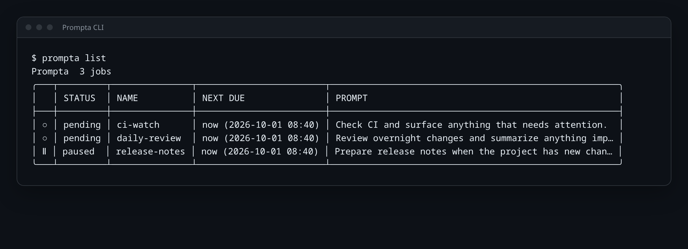
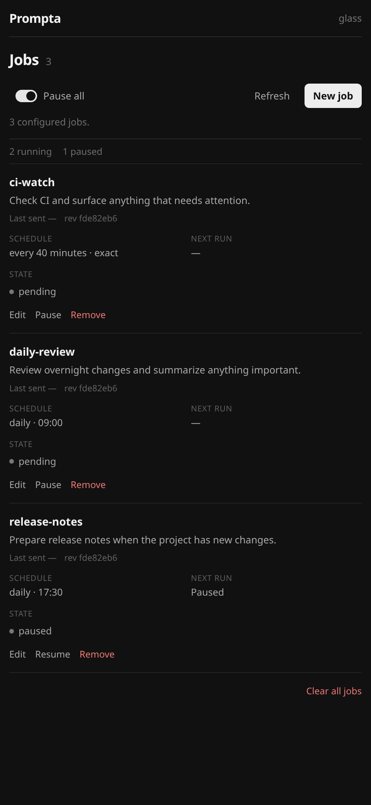

# Prompta

Prompta schedules one-off and recurring prompts for ChatGPT. Jobs can be managed from the CLI or the mobile-friendly web UI; each run opens a fresh ChatGPT chat, submits the prompt, and leaves the response to ChatGPT.

<p align="center">
  
</p>

<p align="center">
  
</p>

## Run

```bash
git clone https://github.com/brandonp2412/Prompta.git ~/prompta
cd ~/prompta
uv sync --locked
bun install --frozen-lockfile
bun run build

mkdir -p ~/.config/systemd/user
cp systemd/prompta-*.service systemd/prompta.target ~/.config/systemd/user/
systemctl --user daemon-reload
systemctl --user enable --now prompta.target
```

The UI is at `http://127.0.0.1:8765`. The CLI is available as `uv run prompta`, for example:

```bash
uv run prompta add nightly-review "Review the project and improve it" --daily-at 21:00
uv run prompta edit nightly-review "Review the project, improve it, and update the ledger"
uv run prompta list
```

## Working hours

To prevent Prompta from starting ChatGPT delivery work outside a local-time window, create
`~/.config/prompta/config.toml`:

```toml
[working_hours]
enabled = true
start = "22:30"
end = "08:00"
timezone = "Pacific/Auckland"
```

The start time is inclusive and the end time is exclusive. Overnight windows are supported.
Queued jobs remain durable while delivery is blocked and resume when the window opens. If
`working_hours` is omitted or disabled, Prompta can deliver at any time.

## Login to ChatGPT

Prompta uses a dedicated Chromium profile. Stop the background browser, open that same profile visibly, and log in at ChatGPT:

```bash
systemctl --user stop prompta-browser.service

/opt/brave-bin/brave \
  --user-data-dir="$HOME/.local/state/prompta/chrome-profile" \
  --profile-directory=Default \
  --password-store=basic \
  --remote-debugging-port=9222 \
  https://chatgpt.com
```

After login, close that browser window and start Prompta's browser again:

```bash
systemctl --user start prompta-browser.service
```
